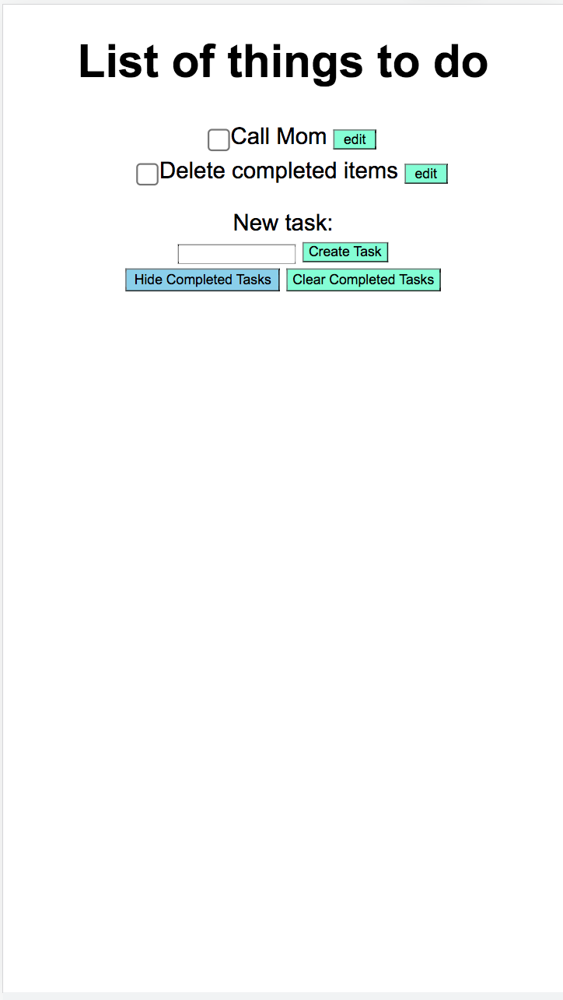
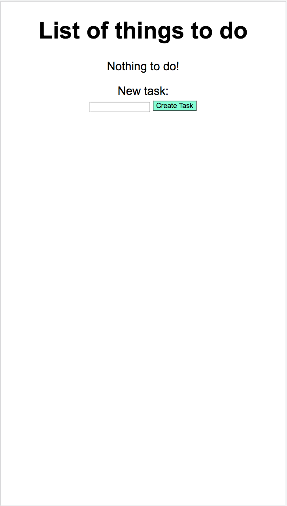

* Our design decisions:

    * We decided to design a minimalist task list because we wanted it to be easy to use and view.
    * We also wanted to (somewhat) emulate a classic paper check list so we included checkboxes and strikethrough upon checking the task.

* Alternative designs:
    * We wanted to have it so that the completed tasks would disappear from the screen upon checking it off. We scrapped the idea because creating that function was more complicated than we intended.

* Any user testing you did 

    * We did not do any user testing due to spending most of the time on programming. 

* Final design & Flow:
  * Full functionality page:
    
  * Start page:
    
  * From the start page, the first thing to add is "Buy new John Grisham book"
  * After that it displays the list with the new task
  

* Challenges we faced 
    * We really were not sure initially how to go from one step to another with each given task.
    * Setting up the ssh keys was a pain because it was a new concept to us.

* Parts of the design we're most proud of:

    * We were proud of the strikethrough on checked items. It was a pretty creative idea by Giovanni
    * We were also proud of the edit buttons we made to give the user a feeling of control over their tasks. 
